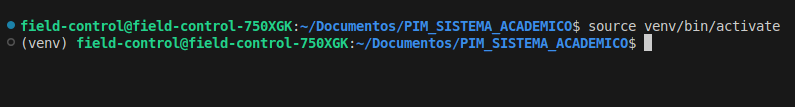


# PIM_SISTEMA_ACADEMICO

# Instruções iniciais:

primeiramente para rodar a aplicação é necessario utilizar um ambiente virtual. Utilize:

### For Windows(na maioria dos casos):
    python -m venv venv

### For Linux(na maioria dos casos):
    python3 -m venv venv

## Requisitos e bibliotecas da aplicação:
O projeto depende de bibliotecas como, TkInter, TkCalendar, FastApi, etc...
Mas não se preocupe tudo pode ser automatizado utilizando os requirements.txt
**DEPOIS** de ter instalado a o ambiente virtual, acesse o ambiente

### Linux:
rode no terminal:

    source venv/bin/activate

### Windows:

    .venv\Scripts\activate
seu terminal deve ter esta carinha aqui:

note que antes do nome do usuario do sistema esta escrito: "(venv)"
significa que o ambiente virtual esta rodando

### Instalando as bibliotecas e dependencias

depois de ativar o ambiente virtual rode no terminal:

    pip install -r requirements.txt

Isto vai instalar **TUDO** para você, com excessão ao que esta no alerta final, pois nao depende somente da venv neste caso, atente-se ao final do README [Clique Aqui](#alerta-sobre-rodar-no-linux)

# Manual de como rodar & Como funciona a aplicação

<u>*🚧⚠️ **PENDENTE:** [AREA PARA A EXPLICAÇÃO DE COMO RODAR CERTINHO( rodar backend, rodar front end e etc...) E COMO FUNCIONA O APP] To falando contigo mesmo **VINI** poe uma explicação ajeitadinha pq no ultimo pim nos nao anotou nada, mas como tava fechado, tava safe, aqui tem que ficar bunituw ⚙️⏳⚠️*</u>

## ALERTA SOBRE RODAR NO LINUX
**caso for rodar o frontend no linux porfavor rodar as instruções:**

    sudo apt update
    sudo apt install python3-tk -y
